# Zaman Serisi Anomali Tespiti: Derin Öğrenme ve Olasılıksal Otomata Yaklaşımları
 
 
Bu proje, kritik altyapı zaman serilerindeki anomalileri tespit etmek amacıyla iki farklı modelleme paradigmasını karşılaştırmalı olarak ele almaktadır: **Derin Öğrenme** modelleri olan LSTM ve GRU ile **Açıklanabilir** bir yaklaşım olan **Olasılıksal Otomata (Probabilistic Automata)** modeli.
 
---
## Proje Bilgileri
 
* Ders: Yazılım Geliştirme Laboratuvarı-II / Proje-2
* Proje Adı: Zaman Serisi Anomali Tespiti
* Ekip Üyeleri:
    - [Şevval Ceren Yıldız](https://github.com/tayrubys)
    - [Berkay Çelik](https://github.com/0berkayc)
---
 
## 1. Proje Amacı
 
Projenin temel amacı, endüstriyel kontrol sistemleri ve su dağıtım şebekeleri gibi kritik altyapılardan toplanan zaman serisi verilerinde anomali tespiti gerçekleştirmektir.
 
Bu kapsamda iki farklı yaklaşım karşılaştırılmıştır:
 
- **Derin öğrenme modelleri:** LSTM ve GRU
- **Açıklanabilir otomata modeli:** PAA, SAX ve olasılıksal state transition yapısına dayalı Probabilistic Automata

Derin öğrenme modelleri yüksek tahmin performansı potansiyeline sahipken, otomata modeli daha düşük hesaplama maliyeti, açık state-transition yapısı ve karar sürecinin olasılıksal olarak yorumlanabilmesi açısından avantaj sağlamaktadır.
 
---
 
## 2. Veri Setleri
Projede iki farklı zaman serisi anomali veri seti kullanılmıştır:
 
### BATADAL
 
BATADAL, su dağıtım şebekesi üzerinden toplanan SCADA verilerini içeren bir veri setidir. Bu çalışmada yalnızca etiketli olan **Training Dataset 2** kullanılmıştır. Veri zaman sırası korunarak eğitim (%60), doğrulama (%20) ve test (%20) kümelerine ayrılmıştır.
 
Hedef sütun: **`ATT_FLAG`** (0 = normal, 1 = saldırı/anomali). Bu sütun `data_loader.py` içindeki `guess_batadal_target_column` fonksiyonu tarafından `target_candidates` listesi üzerinden otomatik olarak tespit edilmektedir.
 
### SKAB
 
SKAB, su tankı sisteminde gerçekleşen fiziksel arızalar ve anomalileri içeren çok değişkenli bir zaman serisi veri setidir. Proje kapsamında yalnızca `valve1` ve `valve2` klasörleri kullanılmıştır. Hedef sütun: **`anomaly`**.
 
SKAB veri seti dosya bazlı yapıya sahip olduğu için aynı dosyadan gelen kayıtların hem eğitim hem test kümesinde yer almaması hedeflenmiştir. Bu nedenle SKAB deneyleri GroupKFold ile fold bazlı değerlendirme mantığıyla ele alınmıştır. StratifiedGroupKFold, grup kısıtını korurken sınıf dağılımını da dengelemeyi hedefler; ancak SKAB'daki anomali oranı fold'lar arasında dengelenmeye çalışıldığında bazı fold'larda yeterli anomali örneği bulunamamaktadır. Bu nedenle grup bütünlüğünü koruyan GroupKFold tercih edilmiştir.
 
### Veri Dizini
 
Ham veri dosyaları aşağıdaki yollara yerleştirilmelidir (`settings.json` yapılandırması):
 
```
data/raw/BATADAL/Training_Dataset_2.csv
data/raw/SKAB/valve1/
data/raw/SKAB/valve2/
```
 
---
 
## 3. Veri Ön İşleme
 
Ham veriler modellere verilmeden önce aşağıdaki ön işleme adımları uygulanmıştır:
 
1. **Eksik Veri Kontrolü:** Veri setlerinde eksik veya hatalı değerler kontrol edilmiştir. Model girdisi olarak kullanılan sensör/sistem değişkenlerinde eksik değer bulunmadığı durumda ek bir doldurma işlemi uygulanmamıştır.
2. **Normalizasyon:** Model eğitiminde ölçek farklarının etkisini azaltmak için sensör değişkenleri normalize edilmiştir.
3. **PCA ile Boyut İndirgeme:** Otomata modeli tek boyutlu veri ile çalıştığı için çok değişkenli veri setleri PCA ile tek boyuta indirgenmiş ve ilk temel bileşen olan PC1 kullanılmıştır.
4. **Sekans Oluşturma:** LSTM ve GRU modelleri için zaman serileri kayan pencere mantığıyla sekanslara dönüştürülmüştür.

Veri sızıntısını önlemek amacıyla normalizasyon ve PCA dönüşümleri eğitim verisi üzerinde fit edilmiş, doğrulama ve test verilerine aynı dönüşüm uygulanmıştır.
 
---
 
## 4. Deep Learning Yöntemi
 
Deep learning tarafında iki farklı ardışıl model kullanılmıştır:
 
- **LSTM (Long Short-Term Memory)**
- **GRU (Gated Recurrent Unit)**

Bu modeller zaman pencereleri üzerinden normal/anomali sınıflandırması yapacak şekilde eğitilmiştir. Modellerin eğitiminde epoch üst sınırı 50, batch size 32 ve early stopping mekanizması kullanılmıştır.
 
Deneylerin daha güvenilir olması için deep learning modelleri 5 farklı random seed ile çalıştırılmıştır:
 
```text
42, 123, 2026, 7, 999
```
 
Sonuçlar ortalama ve standart sapma değerleriyle raporlanmıştır.
 
### Model Mimarisi
 
Her iki model de aynı katman yapısını paylaşır (`src/models/deep_model.py`):
 
```
[LSTM / GRU] (64 units)
      ↓
  Dropout (0.3)
      ↓
  Dense (32, ReLU)
      ↓
  Dropout (0.2)
      ↓
  Dense (1, Sigmoid)
```
 
Kayıp fonksiyonu: `binary_crossentropy` | Optimizer: `Adam (lr=0.001)`
 
Anomali kararı için değerlendirilen eşik değerleri: `0.5, 0.4, 0.3, 0.2, 0.1`
 
---
 
## 5. Model Performansı ve Stabilitesi
 
Deep learning modelleri 5 farklı random seed ile çalıştırılmış, sonuçlar ortalama F1-score ve standart sapma olarak raporlanmıştır.

### Tablo 1: Model Performansı ve Stabilitesi (Ortalama F1-score ± Standart Sapma)

| Model | BATADAL | SKAB |
| :--- | :--- | :--- |
| LSTM | 0.5609 ± 0.3453 | 0.8581 ± 0.0393 |
| GRU | 0.5585 ± 0.1975 | 0.8649 ± 0.0342 |
| Automata | 0.1212 ± 0.0000 | 0.4286 ± 0.2378 |

### BATADAL — Detaylı Sonuçlar

| Model | Accuracy Mean | Precision Mean | Recall Mean | F1 Mean |
| :--- | ---: | ---: | ---: | ---: |
| GRU | 0.9006 | 0.4815 | 0.6825 | 0.5585 |
| LSTM | 0.9332 | 0.5922 | 0.6100 | 0.5609 |
 
BATADAL veri setinde LSTM ve GRU modellerinin F1-score değerleri birbirine oldukça yakın çıkmıştır. LSTM daha yüksek accuracy ve precision üretirken, GRU recall açısından daha yüksek sonuç vermiştir.

### SKAB — Detaylı Sonuçlar

| Model | Accuracy Mean | Precision Mean | Recall Mean | F1 Mean |
| :--- | ---: | ---: | ---: | ---: |
| GRU | 0.9089 | 0.9161 | 0.8297 | 0.8649 |
| LSTM | 0.9047 | 0.9106 | 0.8215 | 0.8581 |
 
SKAB veri setinde GRU, LSTM modeline göre çok küçük bir farkla daha yüksek F1-score ve recall değeri üretmiştir. İki modelin performansı birbirine yakın olmakla birlikte, SKAB üzerinde deep learning modellerinin daha kararlı sonuç verdiği görülmüştür.
 
---
 
## 6. Automata Yöntemi
 
Olasılıksal Otomata modeli, zaman serisini sembolik durumlara dönüştürerek bu durumlar arasındaki geçiş olasılıklarını öğrenen açıklanabilir bir modeldir.
 
Modelin genel işleyişi şu şekildedir:
 
1. Zaman serisi kayan pencerelere ayrılır.
2. Her pencere PAA ile özetlenir.
3. PAA çıktıları SAX ile sembolik harf dizilerine dönüştürülür.
4. Her benzersiz sembolik pattern bir state olarak kabul edilir.
5. Eğitim verisinden state transition frekansları çıkarılır.
6. Frekanslar olasılığa dönüştürülerek transition probability matrisi oluşturulur.
7. Test sırasında düşük olasılıklı geçişler anomali adayı olarak değerlendirilir.

Olasılıksal otomata modelinde geçiş olasılığı şu mantıkla hesaplanır:
 
```text
P(Si -> Sj) = Si durumundan Sj durumuna geçiş sayısı / Si durumundan çıkan toplam geçiş sayısı
```
 
### Laplace Düzleştirme (Smoothing)
 
Model, eğitimde hiç görülmemiş geçişlere sıfır olasılık atamaktan kaçınmak için Laplace smoothing uygular (`smoothing=True`):
 
```text
P(Si -> Sj) = (geçiş_sayısı + 1) / (toplam_çıkış + |eğitim_pattern_seti|)
```
 
Smoothing kapalıyken (`smoothing=False`) saf frekans tabanlı olasılık kullanılır; eğitimde görülmemiş geçişler için `0.0` döner.
 
### Anomali Eşik Değerleri
 
```text
BATADAL : 0.05
SKAB    : 0.90
```
 
---
 
## 7. PAA / SAX / Sliding Window
 
Otomata modelinin zaman serisini sembolik hale getirmesi için üç temel işlem uygulanmıştır:
 
### Sliding Window
 
Zaman serisi belirli bir `window_size` değerine göre alt pencerelere bölünür. Her pencere, modelin bir pattern üretmesi için kullanılır.
 
### PAA
 
PAA, her pencereyi daha küçük alt parçalara ayırarak bu parçaların ortalama değerlerini hesaplar. Böylece zaman serisinin genel şekli korunurken boyut azaltılır.
 
### SAX
 
SAX, PAA çıktısı olan sayısal değerleri sembolik harflere dönüştürür. Örneğin:
 
```text
[0.2, -0.5, 1.1] -> "acb"
```
 
Bu sembolik diziler otomata modelinin state yapısını oluşturur.
 
---
 
## 8. Levenshtein Unseen Pattern Yönetimi
 
Test aşamasında eğitim verisinde hiç görülmemiş pattern'lar ile karşılaşılabilir. Bu durumda modelin doğrudan hata vermemesi için Levenshtein Distance mekanizması kullanılmıştır.
 
İşleyiş şu şekildedir:
 
1. Test sırasında gelen pattern eğitim sözlüğünde aranır.
2. Eğer pattern eğitimde yoksa unseen pattern olarak işaretlenir.
3. Bu pattern ile eğitimde görülen tüm pattern'lar arasında Levenshtein Distance hesaplanır.
4. En yakın pattern bulunur.
5. Model bu en yakın state üzerinden işlemine devam eder.

Bu yaklaşım, unseen pattern durumunda modelin tamamen çökmesini engeller. Ancak unseen senaryosunda performansın belirgin şekilde düştüğü görülmüştür. Bu durum, eğitim sözlüğünde bulunmayan pattern'ların otomata modeli için zorlayıcı olduğunu göstermektedir.
 
---
 
## 9. Explainability Çıktısı
 
Otomata modelinin en önemli avantajlarından biri karar sürecinin açıklanabilir olmasıdır. Model, her karar için state transition ve olasılık bilgilerini raporlayabilir.
 
Üretilen explainability çıktıları JSON formatında saklanmıştır:
 
```text
results/outputs/automata_batadal_explainability.json
results/outputs/automata_batadal_advanced_explainability.json
```
 
Aşağıda örnek bir explainability çıktısı verilmiştir:
 
```json
{
    "time_step": 5,
    "current_state": "aab",
    "incoming_pattern": "adc",
    "status": "unseen",
    "mapped_to": "abc",
    "distance": 1,
    "transition_probability": 0.0714,
    "cumulative_path_probability": 0.0089,
    "decision": "anomaly",
    "confidence_score": 0.0714,
    "decision_reason": "Gecis olasiligi (0.0714) esik degerin altinda kaldigi icin anomali! Ayrica veri unseen oldugu icin Levenshtein ile abc durumuna (Mesafe: 1) eslendi.",
    "transition_history": ["aab", "abc"]
}
```
 
Her alanın anlamı:
 
- `current_state`: Modelin bulunduğu mevcut durum
- `incoming_pattern`: Test adımında gözlemlenen sembolik örüntü
- `status`: Pattern'ın eğitim sözlüğünde bulunup bulunmadığı (`seen` / `unseen`)
- `mapped_to`: Unseen durumunda Levenshtein ile eşleştirilen en yakın pattern
- `distance`: Levenshtein uzaklığı
- `transition_probability`: O adımdaki geçiş olasılığı P(Si→Sj)
- `cumulative_path_probability`: Sekansın başından o ana kadar biriken path probability (∏ geçiş olasılıkları)
- `confidence_score`: Modelin o adımdaki karar güveni. Anlık geçiş olasılığı P(Si→Sj) kullanılarak hesaplanır. Kümülatif path probability sekans uzadıkça çok küçük değerlere indiğinden kararlı bir güven skoru üretememektedir; bu nedenle her adımın bağımsız geçiş olasılığı confidence score olarak tercih edilmiştir.
- `decision`: Anomali / normal kararı

### Gelişmiş Açıklanabilirlik: Karşıt Durum Analizi (Counterfactual)
 
Model, her karar adımı için yalnızca gerçekleşen geçişi değil; alternatif pattern'lar altında kararın nasıl değişeceğini de raporlar. Bu **counterfactual analiz**, mevcut state'ten en yüksek olasılıklı 3 alternatif geçişi listeler ve her biri için "bu pattern gelseydi karar anomali mi olurdu?" sorusunu yanıtlar.
 
```json
"counterfactual_analysis": [
    {"pattern": "aab", "probability": 0.72, "would_be_anomaly": false},
    {"pattern": "bcc", "probability": 0.18, "would_be_anomaly": false},
    {"pattern": "abc", "probability": 0.05, "would_be_anomaly": true}
]
```
 
Bu çıktı sayesinde "hangi pattern gelseydi karar değişirdi?" sorusu doğrudan yanıtlanabilmektedir. Anomali kararlarının ne kadar kırılgan olduğu — yani karar sınırına ne kadar yakın olunduğu — somut olasılık farkları üzerinden görülmektedir.
 
### Gelişmiş Açıklanabilirlik: Benzerlik Tabanlı Analiz (Similarity Report)
 
Unseen pattern durumunda model, yalnızca en yakın pattern'ı değil; Levenshtein mesafesine göre sıralanmış en yakın 3 pattern'ı da raporlar.
 
```json
"similarity_analysis": [
    {"pattern": "abc", "distance": 1},
    {"pattern": "bcc", "distance": 2},
    {"pattern": "aab", "distance": 2}
]
```
 
Bu bilgi, eşleştirme kararının ne kadar güvenilir olduğunu değerlendirmeye yarar. Mesafe 1 ise eşleştirme güçlüdür; mesafe büyükse modelin fallback kararı daha belirsizdir.
 
---
 
## 10. Deneysel Tasarım
 
Deneyler üç temel senaryo altında yürütülmüştür:
 
1. **Original Data:** Orijinal test verileri üzerinde değerlendirme
2. **Gaussian Noise:** Test verilerine Gauss gürültüsü eklenmiş senaryo
3. **Unseen Data:** Eğitim sözlüğünde bulunmayan pattern'ların test sırasında görülmesi

Deep learning modelleri 5 farklı seed ile çalıştırılmıştır. SKAB veri setinde fold bazlı değerlendirme yapılmış, sonuçlar ortalama ve standart sapma ile raporlanmıştır.
 
Otomata modelinde sabit karşılaştırma için başlangıç parametreleri:
 
```text
window_size = 4
alphabet_size = 3
```
 
Parametre analizi için şu değerler denenmiştir:
 
```text
window_size: 3, 4, 5, 6
alphabet_size: 3, 4, 5, 6
```
 
Parametrelerin model performansı, state sayısı ve transition density üzerindeki etkisi incelenmiştir.
 
---
 
## 11. Deep Learning vs Automata Karşılaştırması
 
Merkezi model karşılaştırma tablosu `results/outputs/model_comparison_results.csv` dosyasında saklanmıştır.
 
| Dataset | Model | Scenario | Accuracy | Precision | Recall | F1-Score |
| :--- | :--- | :--- | ---: | ---: | ---: | ---: |
| BATADAL | GRU | original | 0.9006 | 0.4815 | 0.6825 | 0.5585 |
| BATADAL | LSTM | original | 0.9332 | 0.5922 | 0.6100 | 0.5609 |
| BATADAL | Automata | original | 0.5756 | 0.0652 | 0.8571 | 0.1212 |
| SKAB | GRU | original | 0.9089 | 0.9161 | 0.8297 | 0.8649 |
| SKAB | LSTM | original | 0.9047 | 0.9106 | 0.8215 | 0.8581 |
| SKAB | Automata | original | 0.5335 | 0.3729 | 0.5181 | 0.4286 |
 
### Yorum
 
BATADAL veri setinde LSTM ve GRU modelleri yüksek accuracy ve dengeli F1-score değerleri üretmiştir. Otomata modeli bu veri setinde yüksek recall (0.857) elde etmiş; yani gerçek anomalilerin büyük bölümünü yakalamış, ancak precision değeri düşük kalmıştır. Bu durum, modelin anomali eşiğine karşı hassas davranması ve fazla sayıda false positive üretmesinden kaynaklanmaktadır.
 
SKAB veri setinde GRU ve LSTM modelleri F1-score açısından belirgin biçimde üstündür. Otomata modeli SKAB'da daha dengeli bir precision-recall dengesi sergilemiş ve F1-score 0.43 düzeyine ulaşmıştır. Otomata modelinin en önemli avantajı performans değil; state transition probability, path probability ve confidence score üzerinden karar sürecini şeffaf biçimde raporlayabilmesidir.
 
---
 
## 12. Gürültü ve Unseen Veri Analizi (Robustness)

Modellerin veri kalitesindeki düşüşlere ve görülmemiş örüntülere karşı direncini ölçmek için iki senaryo test edilmiştir.

### Tablo 2: Gürültü Etkisi ve Unseen Senaryo Analizi

Detection Rate, unseen senaryosunda anomalilerin ne kadarının yakalandığını gösterir (Recall). Mapping Accuracy projede ölçülmemiştir.

| Model | Orijinal F1 | Gürültülü F1 | Unseen F1 | Detection Rate (Unseen Recall) |
| :--- | ---: | ---: | ---: | ---: |
| LSTM (BATADAL) | 0.5609 | 0.6178 | 0.6447 | 0.7550 |
| GRU (BATADAL) | 0.5585 | 0.2879 | 0.2883 | 0.2325 |
| LSTM (SKAB) | 0.8581 | 0.8405 | 0.6215 | 0.6229 |
| GRU (SKAB) | 0.8649 | 0.8522 | 0.6011 | 0.6006 |
| Automata (BATADAL) | 0.1212 | 0.1200 | 0.0870 | 1.0000 |
| Automata (SKAB) | 0.4286 | 0.4288 | 0.1579 | 0.2000 |

### Gaussian Noise Analizi
 
Gaussian noise senaryosunda test verilerine belirli oranda rastgele Gauss gürültüsü eklenmiştir (`noise_level = 0.1`). Bu senaryo, modelin gürültülü veri koşullarındaki davranışını incelemek için kullanılmıştır.
 
| Dataset | Scenario | F1 Mean | F1 Std |
| :--- | :--- | ---: | ---: |
| SKAB | original | 0.4286 | 0.2378 |
| SKAB | gaussian_noise | 0.4288 | 0.2392 |
| BATADAL | original | 0.1212 | 0.0000 |
| BATADAL | gaussian_noise | 0.1200 | 0.0012 |
 
SAX tabanlı sembolik dönüşüm, eklenen Gaussian gürültüye karşı büyük ölçüde dayanıklı davranmıştır. Gürültü eklenmesi her iki veri setinde de F1-score üzerinde yalnızca marjinal bir değişime yol açmıştır. Bu durum, SAX'ın sürekli değerleri ayrıklaştırma mekanizmasının küçük gürültüleri absorbe edebildiğini göstermektedir.

### Unseen Data Analizi
 
Unseen data senaryosu, eğitim verisinde bulunmayan pattern'ların test sırasında görülmesi durumunu incelemek için oluşturulmuştur. Unseen pattern'lar şu şekilde belirlenmektedir: eğitim verisinden oluşturulan SAX sözlüğü çıkarılır; test sırasında bu sözlükte bulunmayan her pattern unseen olarak işaretlenir.
 
| Dataset | Scenario | F1 Mean | F1 Std | Unseen Pattern Oranı |
| :--- | :--- | ---: | ---: | :--- |
| SKAB | original | 0.4286 | 0.2378 | — |
| SKAB | unseen_data | 0.1579 | 0.3223 | Fold'a göre değişken |
| BATADAL | original | 0.1212 | 0.0000 | — |
| BATADAL | unseen_data | 0.0870 | 0.0000 | Sabit (tek test kümesi) |
 
Unseen data senaryosunda performans her iki veri setinde de belirgin biçimde düşmüştür. SKAB'da original F1 0.43'ten unseen senaryosunda 0.16'ya gerilemiş; BATADAL'da ise 0.12'den 0.09'a düşmüştür. Levenshtein mekanizması modelin tamamen hata vermesini engelleyerek en yakın bilinen pattern üzerinden devam etmesini sağlamış; ancak eşleştirme hatası karar kalitesini olumsuz etkilemiştir. SKAB'daki yüksek standart sapma (0.32), fold'lar arasında unseen pattern oranının önemli ölçüde değiştiğini göstermektedir; bazı fold'larda unseen pattern sayısı çok az olduğundan metrikler güvenilir biçimde hesaplanamamaktadır.

---


 
## 13. Parametre Analizi
 
Otomata modelinde `window_size` ve `alphabet_size` parametrelerinin performans ve model karmaşıklığı üzerindeki etkisi analiz edilmiştir.
 
İncelenen değerler:
 
```text
window_size: 3, 4, 5, 6
alphabet_size: 3, 4, 5, 6
```
 
Parametre analizi sırasında şu değerler takip edilmiştir:
 
- Accuracy, Precision, Recall, F1-score
- Number of states
- Number of transitions
- Transition density

Transition density şu şekilde hesaplanmıştır:
 
```text
transition_density = num_transitions / (num_states * num_states)
```

### Tablo 3: Automata Parametre Duyarlılık Analizi (F1-score)

| Parametre | Değer = 3 | Değer = 4 | Değer = 5 | Değer = 6 |
| :--- | :---: | :---: | :---: | :---: |
| Window Size (alphabet_size=3 sabit) | 0.3043 | 0.1429 | 0.3253 | 0.1876 |
| Alphabet Size (window_size=4 sabit) | 0.1429 | 0.3585 | 0.2961 | 0.2961 |

Tam sonuçlar: `results/outputs/automata_param_sensitivity_metrics.csv`

Parametre analizine göre en yüksek F1-score değeri `window_size = 4`, `alphabet_size = 3` kombinasyonunda elde edilmiştir (F1: 0.1212). Parametre boyutu arttıkça state sayısı yükselmiş, transition density azalmış ve veri seyrekliği nedeniyle model performansı düşmüştür. Bu durum, yüksek boyutlu sembolik uzayda yeterli istatistik birikmesinin güçleşmesinden kaynaklanmaktadır.

---

## 14. Modellerin Çalışma Süresi (Runtime)

### Tablo 4: Modellerin Çalışma Süresi Karşılaştırması

| Model | Dataset | Training Time (sn) | Inference Time (sn) |
| :--- | :--- | :---: | :---: |
| LSTM | BATADAL | 3.56 | 0.2208 |
| GRU | BATADAL | 4.18 | 0.2508 |
| Automata | BATADAL | 0.0000 | 0.0192 |
| LSTM | SKAB (fold 1) | 11.44 | 0.4399 |
| GRU | SKAB (fold 1) | 12.76 | 0.4881 |
| Automata | SKAB (fold 1) | 0.0066 | 0.0188 |

Otomata modeli, derin öğrenme modellerine kıyasla hem eğitim hem de çıkarım süreleri açısından belirgin biçimde daha hızlıdır. BATADAL'da LSTM eğitimi 3.56 saniye sürerken Automata neredeyse anlık tamamlanmaktadır. Bu durum, Automata modelinin hesaplama maliyeti açısından önemli bir avantaj sunduğunu göstermektedir.

---
 
## 15. Görseller
 
Proje kapsamında hem deep learning hem de otomata modelleri için görseller üretilmiştir.
 
### Deep Learning Görselleri
 
#### BATADAL Metrik Karşılaştırması
 
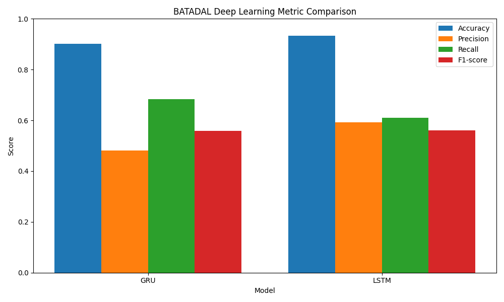
 
#### SKAB Metrik Karşılaştırması
 
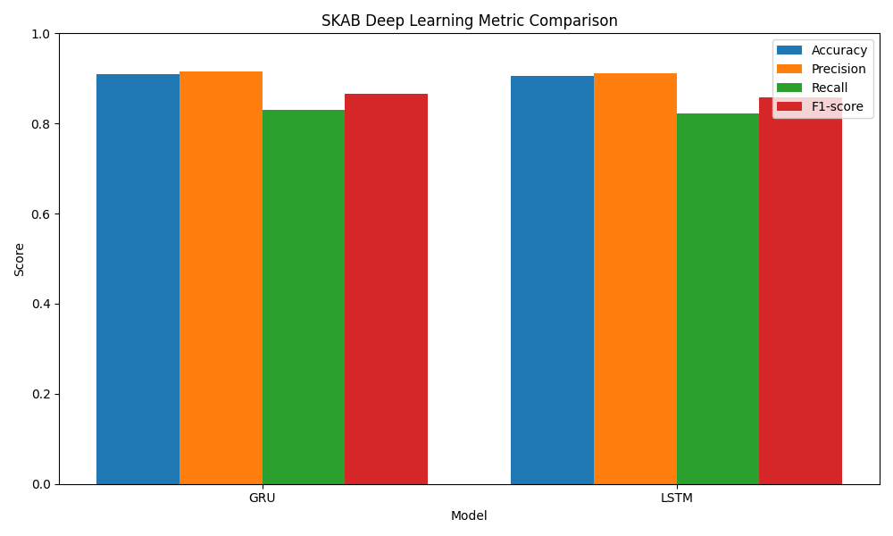
 
#### Deep Learning F1 Karşılaştırması
 
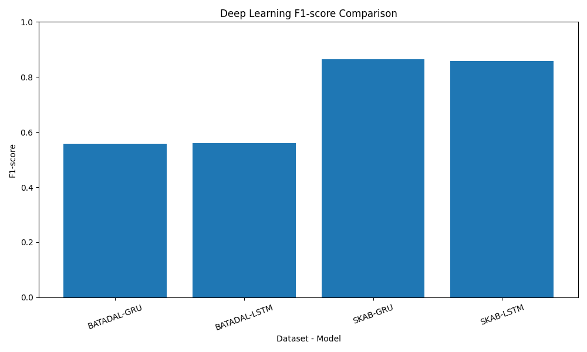
 
#### BATADAL LSTM Confusion Matrix
 
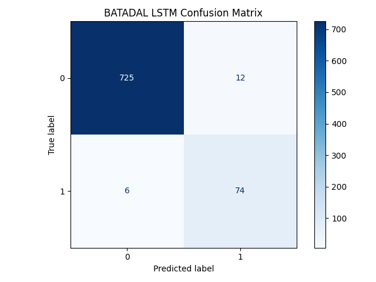
 
#### BATADAL GRU Confusion Matrix
 

 
#### SKAB LSTM Confusion Matrix
 
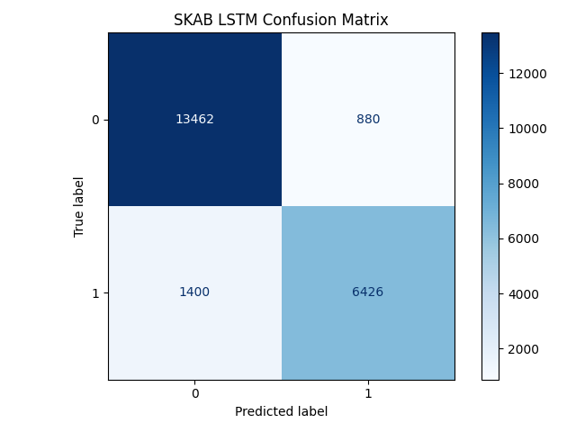
 
#### SKAB GRU Confusion Matrix
 
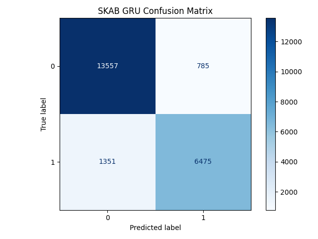
 
#### BATADAL LSTM Precision-Recall Curve
 
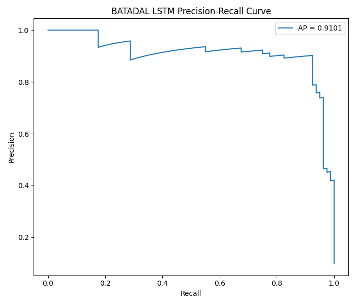
 
#### BATADAL GRU Precision-Recall Curve
 
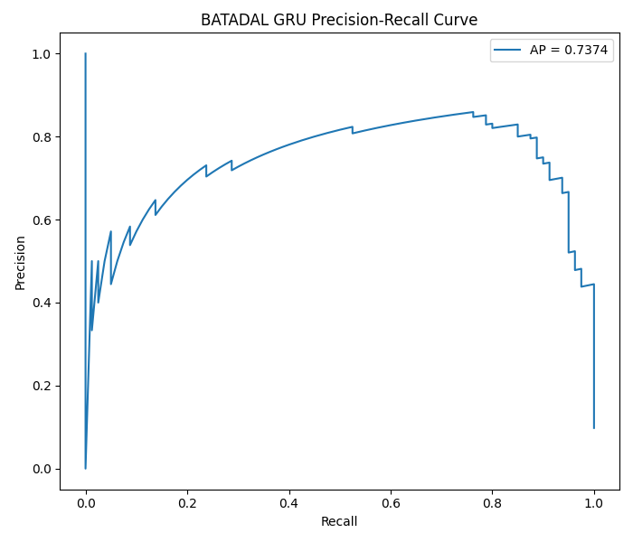
 
#### SKAB LSTM Precision-Recall Curve
 
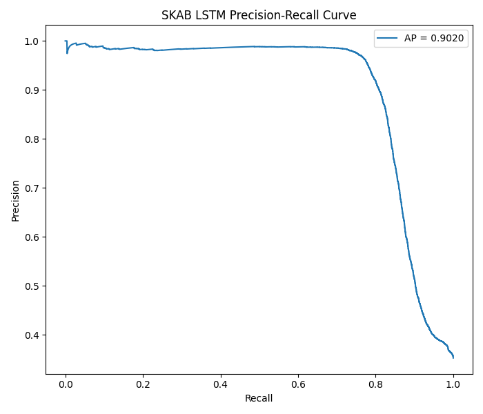
 
#### SKAB GRU Precision-Recall Curve
 
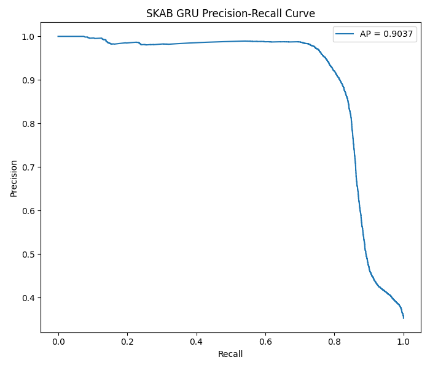
 
### Automata Görselleri
 
#### Automata State Diagram
 
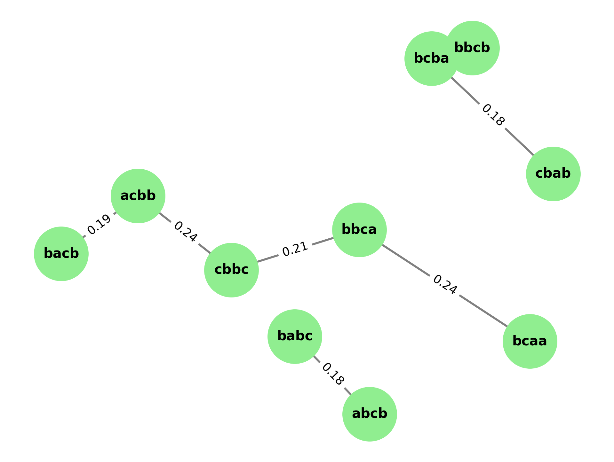
 
#### Transition Probability Heatmap
 
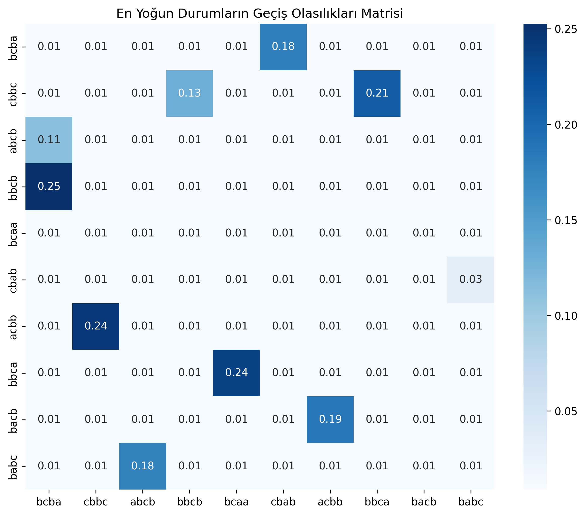
 
#### Parametre Duyarlılık Grafiği
 
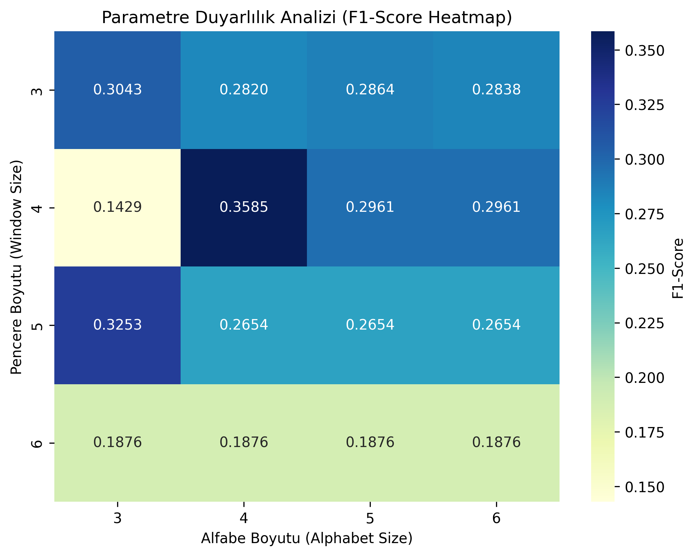
 
#### Parametre Karmaşıklık Analizi
 
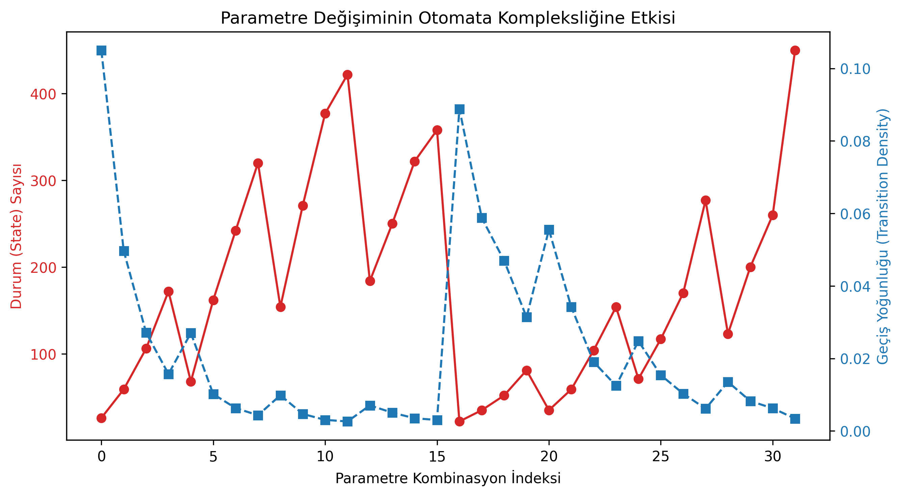
 
### Ortak Model Karşılaştırma Görselleri
 
#### Model Karşılaştırması - F1 Score
 
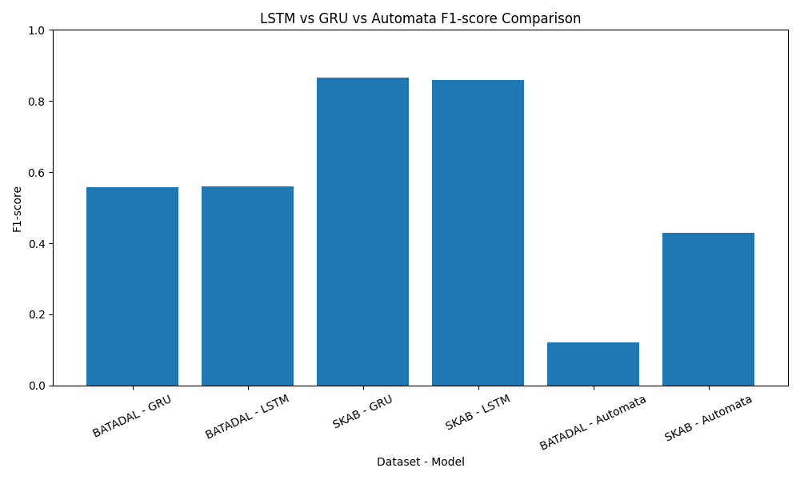
 
#### Model Karşılaştırması - Tüm Metrikler
 
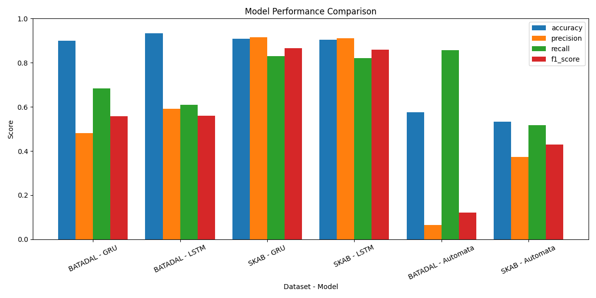
 
---
 
## 16. Çalıştırma Komutları
 
Önce bağımlılıkları yükleyin:
 
```bash
pip install -r requirements.txt
```
 
Veri ön işleme:
 
```bash
python -m src.data_pipeline.run_preprocessing
python -m src.data_pipeline.run_sequence_building
```
 
Deep learning deneyleri:
 
```bash
python -m src.experiments.run_batadal_seed_experiments
python -m src.experiments.run_skab_seed_experiments
```

Deep learning robustness deneyleri (Gaussian Noise + Unseen):

```bash
python -m src.experiments.run_batadal_robustness_experiments
python -m src.experiments.run_skab_robustness_experiments
```
 
Deep learning görselleri:
 
```bash
python -m src.experiments.plot_deep_learning_figures
python -m src.experiments.plot_batadal_diagnostics
python -m src.experiments.plot_skab_diagnostics
```
 
Otomata deneyleri:
 
```bash
python -m src.experiments.runner
```
 
Otomata görselleri:
 
```bash
python -m src.experiments.visualizer
```
 
Model karşılaştırma sonuçları:
 
```bash
python -m src.experiments.create_comparison_results
python -m src.experiments.plot_model_comparison
```
 
İstatistiksel testler:
 
```bash
python -m src.experiments.statistical_tests
```

Runtime ölçümü:

```bash
python -m src.experiments.run_runtime_measurement
```
 
Unit testler:
 
```bash
python -m unittest discover tests
```
 
Windows ortamında sanal ortamı aktif etmek için:

```bash
venv\Scripts\activate
```

macOS/Linux ortamında sanal ortamı aktif etmek için:

```bash
source venv/bin/activate
```

Tüm komutları adım adım çalıştırmak için **Kurulum ve Hızlı Başlangıç** bölümüne bakınız.

---
 
## 17. Testler
 
`tests/` klasöründe aşağıdaki birim test modülleri bulunmaktadır:
 
| Dosya | Kapsam |
| :--- | :--- |
| `test_automata.py` | `ProbabilisticAutomata` çekirdek davranışları: fit, transition probability, Laplace smoothing, anomali kararı, olasılık sınırları, unseen pattern eşleştirme |
| `test_levenshtein.py` | `_calculate_levenshtein` fonksiyonu: exact match, substitution, boş string edge case'leri, farklı uzunluklar, karmaşık dönüşümler |
| `test_unseen.py` | Unseen pattern yönetimi: Levenshtein doğruluğu, `_find_nearest_pattern`, `predict` çıktısındaki `status` / `mapped_to` / `distance` alanları |
| `test_sax_paa.py` | `SaxPaaTransformer`: PAA segment ortalamaları, SAX harf eşleşmesi, kayan pencere sayısı ve içeriği, transform pipeline |
| `test_evaluator.py` | `evaluate_binary_classification` ve `calculate_metrics`: mükemmel/yanlış/kısmi tahmin, sıfır bölme koruması, confusion matrix |
| `test_explainability.py` | `AutomataExplainer.generate_log`: zorunlu alanlar, seen/unseen karar metni, None → [] dönüşümü, float tip kontrolü |
| `test_preprocess.py` | `split_features_target`, `check_missing_values`, `scale_train_val_test`, `apply_pca_train_val_test`, `split_batadal_time_ordered`: şekil, data leakage, indeks çakışması |
 
---
 
## 18. İstatistiksel Değerlendirme
 
Model farklarının istatistiksel anlamlılığını değerlendirmek amacıyla Wilcoxon Signed-Rank testi uygulanmıştır. Test sonuçları `results/outputs/statistical_test_results.csv` dosyasında saklanmaktadır.
 
### SKAB — Wilcoxon Testi (Fold Bazlı F1 Skorları)
 
| Model A | Model B | Mean A | Mean B | p-value | Anlamlı (p<0.05) |
| :--- | :--- | ---: | ---: | ---: | :--- |
| LSTM | GRU | 0.8404 | 0.8589 | 0.0625 | Hayır |
| LSTM | Automata | 0.8404 | 0.4286 | 0.0625 | Hayır |
| GRU | Automata | 0.8589 | 0.4286 | 0.0625 | Hayır |
 
### BATADAL — Wilcoxon Testi (Seed Bazlı F1 Skorları)
 
| Model A | Model B | Mean A | Mean B | p-value | Anlamlı (p<0.05) |
| :--- | :--- | ---: | ---: | ---: | :--- |
| LSTM | GRU | 0.5609 | 0.5585 | 1.0000 | Hayır |
 
Wilcoxon testi sonuçlarına göre incelenen model çiftleri arasındaki farklar istatistiksel olarak anlamlı bulunmamıştır. SKAB veri setinde LSTM ve GRU F1 ortalamaları birbirine yakın olmakla birlikte Automata modeli belirgin biçimde daha düşük performans göstermiştir; ancak yalnızca 5 fold ile bu fark istatistiksel anlamlılık eşiğine ulaşamamıştır. BATADAL veri setinde ise LSTM ve GRU seed bazlı F1 skorları neredeyse özdeş olduğundan test istatistiksel olarak anlamsız çıkmıştır. Bu sonuçlar, mevcut deney sayısının (5 fold / 5 seed) küçük örneklem etkisini yansıtmakta olup gözlemlenen performans farklarının pratik önemi mevcuttur.
 
---
 
## 19. Genel Sonuç
 
Bu projede derin öğrenme tabanlı black-box modeller ile açıklanabilir olasılıksal otomata modeli iki farklı zaman serisi veri seti üzerinde karşılaştırılmıştır.
 
Elde edilen sonuçlara göre LSTM ve GRU modelleri F1-score açısından otomata modelinden daha yüksek performans üretmiştir. Özellikle SKAB veri setinde deep learning modellerinin yüksek ve kararlı sonuçlar verdiği görülmüştür.
 
Buna karşılık otomata modeli, karar sürecini state, transition probability, path probability ve confidence score üzerinden açıklayabildiği için yorumlanabilirlik açısından güçlü bir avantaj sağlamaktadır. Bu nedenle otomata modeli, yalnızca performans odaklı değil, aynı zamanda açıklanabilirlik gerektiren sistemlerde değerlendirilebilecek bir yaklaşım sunmaktadır.
 
Sonuç olarak, deep learning modelleri tahmin performansı açısından öne çıkarken, olasılıksal otomata modeli açıklanabilirlik ve model davranışlarının izlenebilirliği açısından tamamlayıcı bir rol üstlenmektedir.
 
---
 ## Kurulum ve Hızlı Başlangıç

### 1. Bağımlılıkları Yükle

```bash
python -m venv venv

# Windows
venv\Scripts\activate

# macOS / Linux
source venv/bin/activate

pip install -r requirements.txt
```

### 2. Veri Setlerini İndir ve Yerleştir

Proje iki harici veri seti kullanmaktadır. Aşağıdaki bağlantılardan indirip belirtilen klasörlere yerleştirin:

**BATADAL**
- İndir: [BATADAL GitHub](https://github.com/scy-phy/BATADAL) → `datasets/` klasöründen `Training_Dataset_2.csv`
- Yerleştir: `data/raw/BATADAL/Training_Dataset_2.csv`

**SKAB**
- İndir: [SKAB GitHub](https://github.com/waico/SKAB) → `data/` klasöründen `valve1/` ve `valve2/` klasörleri
- Yerleştir:
  ```
  data/raw/SKAB/valve1/   ← valve1/ klasörünün tüm .csv dosyaları
  data/raw/SKAB/valve2/   ← valve2/ klasörünün tüm .csv dosyaları
  ```

Beklenen dizin yapısı:

```
data/
└── raw/
    ├── BATADAL/
    │   └── Training_Dataset_2.csv
    └── SKAB/
        ├── valve1/
        │   ├── 1.csv
        │   └── ...
        └── valve2/
            ├── 1.csv
            └── ...
```

> Veri yolları `src/config/settings.json` içindeki `paths` anahtarından yönetilmektedir. Dosya konumlarını değiştirdiyseniz bu dosyayı güncelleyin.

### 3. Ön İşleme (Preprocessing)

Ham verileri işleyip `data/processed/` altına kaydedin:

```bash
python -m src.data_pipeline.run_preprocessing
python -m src.data_pipeline.run_sequence_building
```

Bu adım zorunludur; deney scriptleri işlenmiş veriye ihtiyaç duyar.

### 4. Deneyleri Çalıştır

**Deep Learning (LSTM / GRU) — seed deneyleri:**

```bash
python -m src.experiments.run_batadal_seed_experiments
python -m src.experiments.run_skab_seed_experiments
```

**Deep Learning — robustness deneyleri (Gaussian Noise + Unseen):**

```bash
python -m src.experiments.run_batadal_robustness_experiments
python -m src.experiments.run_skab_robustness_experiments
```

**Automata deneyleri:**

```bash
python -m src.experiments.runner
```

**Model karşılaştırma ve istatistiksel testler:**

```bash
python -m src.experiments.create_comparison_results
python -m src.experiments.statistical_tests
python -m src.experiments.run_runtime_measurement
```

### 5. Görselleri Üret

```bash
# Deep learning görselleri
python -m src.experiments.plot_deep_learning_figures
python -m src.experiments.plot_batadal_diagnostics
python -m src.experiments.plot_skab_diagnostics

# Automata görselleri
python -m src.experiments.visualizer

# Ortak karşılaştırma görselleri
python -m src.experiments.plot_model_comparison
```

### 6. Testleri Çalıştır

```bash
python -m unittest discover tests
```

---
## Proje Yapısı
 
```
TimeSeries-Anomaly-Analysis/
├── data/
│   ├── raw/
│   │   ├── BATADAL/
│   │   │   └── Training_Dataset_2.csv
│   │   └── SKAB/
│   │       ├── valve1/
│   │       └── valve2/
│   └── processed/
├── results/
│   ├── figures/
│   └── outputs/
├── src/
│   ├── config/
│   │   ├── __init__.py
│   │   └── settings.json
│   ├── data_pipeline/
│   │   ├── data_loader.py
│   │   ├── debug_sequence_builder.py
│   │   ├── preprocess.py
│   │   ├── run_preprocessing.py
│   │   ├── run_sequence_building.py
│   │   ├── sax_paa.py
│   │   ├── sequence_builder.py
│   │   └── test_sequence_builder.py
│   ├── experiments/
│   │   ├── create_comparison_results.py
│   │   ├── evaluator.py
│   │   ├── merge_results.py
│   │   ├── plot_batadal_diagnostics.py
│   │   ├── plot_deep_learning_figures.py
│   │   ├── plot_model_comparison.py
│   │   ├── plot_skab_diagnostics.py
│   │   ├── result_logger.py
│   │   ├── run_batadal_robustness_experiments.py
│   │   ├── run_batadal_seed_experiments.py
│   │   ├── run_runtime_measurement.py
│   │   ├── run_skab_gru.py
│   │   ├── run_skab_lstm.py
│   │   ├── run_skab_robustness_experiments.py
│   │   ├── run_skab_seed_experiments.py
│   │   ├── runner.py
│   │   ├── statistical_tests.py
│   │   ├── test_evaluator.py
│   │   └── visualizer.py
│   └── models/
│       ├── automata_model.py
│       ├── deep_model.py
│       ├── explainability.py
│       └── test_deep_model.py
├── tests/
│   ├── test_automata.py
│   ├── test_evaluator.py
│   ├── test_explainability.py
│   ├── test_levenshtein.py
│   ├── test_preprocess.py
│   ├── test_sax_paa.py
│   └── test_unseen.py
├── logs/
├── requirements.txt
└── README.md
```
 
---
## Kaynaklar
 
- Tavallaee, M., et al. (2019). *BATADAL: Battle of the Attack Detection Algorithms*. Journal of Water Resources Planning and Management.
- Filonov, P., et al. (2020). *SKAB — Skoltech Anomaly Benchmark*. https://github.com/waico/SKAB
- Lin, J., Keogh, E., Wei, L., & Lonardi, S. (2007). *Experiencing SAX: A Novel Symbolic Representation of Time Series*. Data Mining and Knowledge Discovery, 15(2), 107–144.
- Keogh, E., Chakrabarti, K., Pazzani, M., & Mehrotra, S. (2001). *Dimensionality Reduction for Fast Similarity Search in Large Time Series Databases*. Knowledge and Information Systems, 3(3), 263–286.
- Levenshtein, V. I. (1966). *Binary Codes Capable of Correcting Deletions, Insertions, and Reversals*. Soviet Physics Doklady, 10(8), 707–710.
