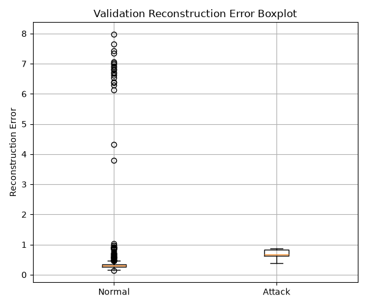

# LSTM AutoEncoder Deneyi

Bu çalışmada BATADAL veri seti üzerinde **LSTM AutoEncoder tabanlı anomali tespiti** gerçekleştirilmiştir. Model yalnızca normal etiketli sequence verileriyle eğitilmiş, anomaliler reconstruction error üzerinden belirlenmiştir.

## Deney Akışı

```text
BATADAL veya SKAB verisi
      ↓
Sequence oluşturma
(window = 20)
      ↓
Uç değerleri kırpma
(np.clip: -5 ile 5)
      ↓
Sadece normal sequence'lerle eğitim
      ↓
LSTM AutoEncoder
      ↓
Validation reconstruction error
      ↓
Percentile tabanlı threshold optimizasyonu
      ↓
Test değerlendirmesi
```

## Model Yapısı

- Encoder: LSTM, 64 unit
- Darboğaz katmanı: Dense, 32 unit
- Decoder: LSTM, 64 unit
- Dropout: 0.3
- Loss: Mean Squared Error
- Batch size: 32
- Maksimum epoch: 100
- Early Stopping patience: 10
- ReduceLROnPlateau patience: 3

## Reconstruction Error Hesaplaması

LSTM AutoEncoder modeli, giriş olarak aldığı bir sequence'i yeniden üretmeye çalışmaktadır. Modelin ürettiği çıktı ile gerçek giriş arasındaki fark **Reconstruction Error** olarak adlandırılır.

Modelin girdisi:

```math
X
```

Model çıktısı:

```math
\hat{X}
```

olarak gösterilsin.

Her sequence için reconstruction error, Ortalama Kare Hata (Mean Squared Error - MSE) kullanılarak hesaplanmaktadır:

```math
\text{Reconstruction Error}
=
\frac{1}{N}
\sum_{i=1}^{N}
(X_i-\hat{X}_i)^2
```

Burada:

* $X_i$: Gerçek sensör değeri
* $\hat{X}_i$: Model tarafından yeniden üretilen sensör değeri
* $N$: Sequence içerisindeki toplam eleman sayısıdır.

Kod içerisinde bu hesaplama aşağıdaki şekilde gerçekleştirilmektedir:

```python
errors = np.mean(
    np.square(X - X_pred),
    axis=(1, 2)
)
```

Bu işlem:

1. Gerçek ve tahmin edilen sequence arasındaki farkı hesaplar.
2. Farkların karesini alır.
3. Tüm zaman adımları ve sensörler boyunca ortalamasını alır.

Elde edilen reconstruction error değeri büyükse, model ilgili sequence'i iyi yeniden üretememiş demektir ve bu durum sequence'in anomali olabileceğini göstermektedir.

Son aşamada validation kümesi üzerinde percentile tabanlı bir threshold seçilerek:

```math
\text{error} \ge threshold
\Rightarrow anomaly
```

kuralı uygulanmıştır.

## Uç Değer İşlemi

Sensörlerdeki aşırı uç değerlerin reconstruction error değerlerini bozduğu gözlemlenmiştir. Bu nedenle train, validation ve test verileri aşağıdaki aralıkta sınırlandırılmıştır:



```python
X_train = np.clip(X_train, -5, 5)
X_val = np.clip(X_val, -5, 5)
X_test = np.clip(X_test, -5, 5)
```

Bu işlem sonucunda 5 farklı seed için daha kararlı test sonuçları elde edilmiştir.

## Seed Bazlı Sonuçlar - Batadal

| Seed | Percentile | Threshold | Accuracy | Precision | Recall | F1-Score |
|-----:|-----------:|----------:|---------:|----------:|-------:|---------:|
| 42 | 99.1 | 0.7473 | 0.9425 | 0.6460 | 0.9125 | 0.7565 |
| 123 | 99.0 | 0.8038 | 0.9412 | 0.6404 | 0.9125 | 0.7526 |
| 2026 | 99.0 | 0.7083 | 0.9523 | 0.6952 | 0.9125 | 0.7892 |
| 7 | 99.3 | 0.7374 | 0.9559 | 0.7157 | 0.9125 | **0.8022** |
| 999 | 99.0 | 0.7266 | 0.9449 | 0.6577 | 0.9125 | 0.7644 |

## Ortalama Sonuçlar

| Metrik | Ortalama ± Standart Sapma |
|---|---:|
| Accuracy | 0.9474 ± 0.0064 |
| Precision | 0.6710 ± 0.0329 |
| Recall | 0.9125 ± 0.0000 |
| F1-Score | **0.7730 ± 0.0217** |
| Threshold | 0.7447 ± 0.0361 |
## Değerlendirme

Uç değerlerin sınırlandırılmasından sonra LSTM AutoEncoder modeli ortalama **0.7730 F1-score** elde etmiştir. Seed sonuçlarının birbirine yakın olması, modelin rastgele başlangıç değerlerine karşı kararlı çalıştığını göstermektedir.

Validation F1 değerlerinin test sonuçlarına göre düşük kalması, validation ve test saldırılarının reconstruction error dağılımlarının farklı olabileceğini göstermektedir. Bu durum ilerleyen çalışmalarda threshold seçimi ve veri bölme stratejileri açısından ayrıca incelenecektir.

## SKAB Deney Yapısı

- Dataset: SKAB
- Sequence Window Size: 20
- Feature Count: 8
- Evaluation Strategy: 5-Fold Cross Validation
- Seed: 42

## Ortalama Sonuçlar (5 Fold Seed=42) - Skab

| Metrik | Ortalama ± Standart Sapma |
|---|---:|
| Accuracy | 0.7706 ± 0.0969 |
| Precision | 0.7653 ± 0.3227 |
| Recall | 0.4419 ± 0.2316 |
| F1-Score | **0.5516 ± 0.2661** |
| Threshold | 0.6716 ± 0.0679 |

## Değerlendirme

SKAB veri seti üzerinde gerçekleştirilen LSTM AutoEncoder deneyinde model ortalama **0.5516 F1-score** elde etmiştir.

Sonuçlar incelendiğinde:

- Precision değerinin yüksek olduğu,
- Recall değerinin ise görece düşük kaldığı görülmektedir.

Bu durum, modelin düşük yanlış alarm üretme eğiliminde olduğunu ancak bazı anomalileri kaçırabildiğini göstermektedir. Model, yalnızca reconstruction error değeri belirgin şekilde yükselen sequence'leri anomali olarak işaretlemiştir.

Ayrıca:

```text
Recall Std : 0.2316
F1 Std     : 0.2661
```

değerlerinin yüksek olması, foldlar arasında belirgin performans farklılıkları olduğunu göstermektedir.

Bu durumun olası nedenleri:

- Farklı operasyon senaryoları,
- Foldlar arasındaki veri dağılımı farklılıkları,
- Sequence window boyutunun etkisi,
- Threshold değerinin tüm foldlara aynı başarıyla genellenememesi.

## Veri Setleri Arası Karşılaştırma

| Dataset | Evaluation | Accuracy | Precision | Recall | F1 |
|----------|-------------|-----------|------------|---------|----|
| BATADAL | 5 Seed Ortalama | 0.9474 | 0.6710 | 0.9125 | **0.7730** |
| SKAB | 5 Fold Ortalama | 0.7706 | 0.7653 | 0.4419 | **0.5516** |
